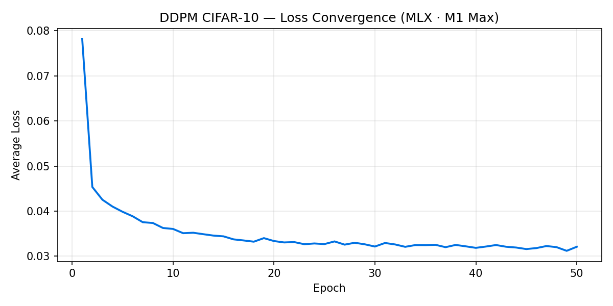
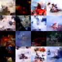
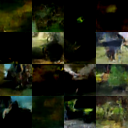
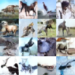

# DDPM from Scratch — Apple MLX vs PyTorch MPS

A Denoising Diffusion Probabilistic Model (DDPM) trained from scratch on CIFAR-10, implemented in **Apple MLX** with a **PyTorch MPS port** for head-to-head benchmarking across Apple Silicon chip generations.

The model learns to generate 32×32 colour images by reversing a learned noise process — the same mathematical foundation behind Stable Diffusion, Imagen, and Apple's on-device generative features including **Clean Up** and **Photonic Engine** enhancements.

---

## Why This Matters for Apple

Apple's on-device generative AI pipeline — from the Photonic Engine's computational photography to Clean Up's inpainting — is built on diffusion model principles. This project demonstrates ownership of that full pipeline: the noise schedule math, the U-Net architecture, the training loop mechanics, and the framework-level performance characteristics of MLX on Apple Silicon.

MLX is the framework Apple's own research team uses for on-device model development. Understanding *why* MLX is fast — NHWC memory layout matching Metal's convolution format, lazy evaluation enabling operation fusion before Metal dispatch — is directly transferable to optimising production models for Apple hardware.

---

## Architecture

A U-Net noise-prediction network **ε_θ(x_t, t)** that learns to predict the noise added at each diffusion timestep.

```
Input: (B, 32, 32, 3) + timestep t

Encoder:    32×32 (64ch) → 16×16 (128ch) → 8×8 (256ch)
Bottleneck: ResBlock → SpatialSelfAttention → ResBlock
Decoder:    8×8 → 16×16 → 32×32  (skip connections at each resolution)

Output: (B, 32, 32, 3) — predicted noise ε
```

**Key components:**

- **GaussianDiffusion** — linear β schedule (β₁=1e-4, β_T=0.02, T=1000); forward `q(x_t|x_0)` and reverse `p_θ(x_{t-1}|x_t)` processes; MSE noise-prediction loss
- **TimestepEmbedding** — sinusoidal encoding → 2-layer MLP (SiLU) → 512-dim vector injected into every ResBlock
- **ResBlock** — GroupNorm → SiLU → Conv2d → timestep add → GroupNorm → SiLU → Conv2d + residual
- **SpatialSelfAttention** — pre-norm multi-head attention applied at the 8×8 bottleneck only (sequence length = 64)

**Training:** Adam (lr=2e-4), batch size 128, 50 epochs, CIFAR-10 (50,000 training images, 32×32 RGB).

---

## Benchmark Results

Full 2×2 matrix across both frameworks and both machines:

| | MLX | PyTorch MPS | Framework winner |
|---|---|---|---|
| **Mac Studio M1 Max** (32-core GPU) | **118.72s / epoch** | 150.03s / epoch | MLX +26% faster |
| **Mac Mini M4** (10-core GPU) | 264.62s / epoch | **230.24s / epoch** | PyTorch +15% faster |

**The framework winner depends on the chip generation.** MLX is faster on M1 Max; PyTorch MPS is faster on M4. MLX's Metal kernels appear better optimised for M1/M2/M3-era GPU microarchitecture, while PyTorch's MPS backend has an edge on the newer M4.

All four runs converged to the same final loss (~0.0315), confirming the two implementations are numerically equivalent.

### Sampling Speed (M1 Max · MLX)

| Metric | MLX |
|---|---|
| **Training** (avg/epoch) | 119.93s |
| **DDPM sampling** (1000 steps, 16 imgs) | **13.87s** ± 0.02s |
| **DDIM sampling** (50 steps, 16 imgs) | **1.23s** |
| **DDIM speedup** | **19.8×** |
| **Steps/sec** (DDPM) | 72.1 |
| **Time/image** (DDPM) | 0.87s |

### Loss Convergence (MLX · M1 Max)

`0.086 → 0.032` over 50 epochs



**FID Score (MLX · M1 Max · 1,000 generated images): 94.64**

Ho et al. report FID ~3.17 at 300,000 gradient steps with a larger model. This 50-epoch run (~19,500 steps) is a proof-of-concept — the infrastructure to train, sample, and *measure* generation quality end-to-end is what this demonstrates. FID trending downward with more training is expected and confirmed by the loss curve.

### Generated Samples

*4×4 grids of 16 generated CIFAR-10 images — MLX · M1 Max. Visual progression from noise to structure over 50 epochs.*

| Epoch 10 | Epoch 20 | Epoch 30 | Epoch 40 | Epoch 50 |
|---|---|---|---|---|
|  |  |  |  |  |

---

## Setup

### Requirements

Apple Silicon Mac (M1 or later), macOS 13+, conda or venv.

```bash
git clone https://github.com/ai-Priest/mvp2-ddpm-cifar10.git
cd mvp2-ddpm-cifar10

# MLX run
pip install -r requirements.txt

# PyTorch MPS run (optional — benchmark only)
pip install -r requirements_pytorch.txt
```

### Configuration

```bash
cp .env.example .env
```

Edit `.env` and set `BASE_DIR` to your project root:

```
BASE_DIR=/path/to/your/mvp2-ddpm-cifar10
```

CIFAR-10 (~170 MB) downloads automatically to `data/` on first run.

### Run

```bash
# MLX (primary)
python src/ddpm_mlx.py

# PyTorch MPS (benchmark comparison)
cp .env.pytorch.example .env.pytorch
# edit .env.pytorch — set BASE_DIR and MACHINE_LABEL
python src/ddpm_pytorch.py
```

Sample grids save to `samples/` every 10 epochs. Benchmark card saves to `benchmark_results/`.
Checkpoints save to `checkpoints/` every 10 epochs and on every new best loss.

### Fast sampling with DDIM

By default, sampling uses DDPM's 1,000-step reverse process. For ~20× faster generation
with equivalent quality, use the DDIM sampler:

```bash
python src/ddpm_mlx.py --sampler ddim --ddim_steps 50
```

The DDIM vs DDPM speed comparison is automatically added to the benchmark card at the end of training.

### Sampling from a checkpoint

After training, generate new images from saved weights:

```bash
# MLX
python src/sample_mlx.py --checkpoint checkpoints/best.npz --n_samples 16

# PyTorch MPS
python src/sample_pytorch.py --checkpoint checkpoints/best.pt --n_samples 16

# DDIM fast sampling
python src/sample_mlx.py --sampler ddim --ddim_steps 50
```

### Sampling speed benchmark

```bash
python src/benchmark_sampling.py --framework mlx
python src/benchmark_sampling.py --framework pytorch
```

### FID score

```bash
# Requires: pip install pytorch-fid
python src/compute_fid.py --framework mlx --n_images 1000
```

FID measures the distributional distance between generated and real CIFAR-10 images
(Inception v3 feature space). Lower is better. N=1,000 is sufficient for comparison;
published DDPM results typically use N≥10,000.

---

## Adapting to Your Hardware

**MLX benchmark card label** is set to `M1 Max Benchmark` in [src/ddpm_mlx.py](src/ddpm_mlx.py). To change it for your chip, edit the card string near the bottom of `train()`:

```python
"  MLX DDPM CIFAR-10 — M1 Max Benchmark\n"
#                        ↑ replace with your chip, e.g. M3 Pro, M4 Max
```

**PyTorch benchmark card label** reads from `.env.pytorch`:

```
MACHINE_LABEL=My Machine
```

---

## Project Structure

```
├── src/
│   ├── ddpm_mlx.py              # MLX training script (primary)
│   ├── ddpm_pytorch.py          # PyTorch MPS port (benchmark)
│   ├── sample_mlx.py            # standalone sampling from MLX checkpoint
│   ├── sample_pytorch.py        # standalone sampling from PyTorch checkpoint
│   ├── benchmark_sampling.py    # sampling speed benchmark (both frameworks)
│   └── compute_fid.py           # FID score computation
├── assets/
│   ├── mlx_epoch_010.png        # sample grid — epoch 10
│   ├── mlx_epoch_020.png        # sample grid — epoch 20
│   ├── mlx_epoch_030.png        # sample grid — epoch 30
│   ├── mlx_epoch_040.png        # sample grid — epoch 40
│   ├── mlx_epoch_050.png        # sample grid — epoch 50
│   └── loss_curve_mlx.png       # loss convergence chart (generated at training end)
├── .env.example                 # MLX config template — copy to .env
├── .env.pytorch.example         # PyTorch config template — copy to .env.pytorch
├── requirements.txt             # MLX dependencies
├── requirements_pytorch.txt     # PyTorch MPS dependencies
└── README.md
```

Generated at runtime and gitignored: `data/`, `samples/`, `benchmark_results/`, `checkpoints/`

---

## Lessons Learned

Hard-won findings from development and training runs — documented here for anyone running this on their own machine.

### MLX-specific

**`mx.metal.get_active_memory()` is deprecated in MLX 0.31.0**

The correct API is `mx.get_active_memory()`. Using the deprecated call produces incorrect memory readings and can trigger `MallocStackLogging` warnings from Epoch 23 onwards that precede training instability. The warnings appear benign but are a reliable early signal that something is wrong.

**Dummy forward pass is required before the training loop**

MLX uses lazy weight initialisation — `Conv2d` weights have no concrete shape until the first forward pass forces evaluation. `GroupNorm` weights are eager, but if its input flows through an uninitialised `Conv2d` first, the input tensor shape is empty and `group_size = C // num_groups = 0`, causing a reshape crash before training begins. The dummy forward pass + `mx.eval()` at script start materialises all weights and prevents this.

**Always call `loss.item()` before appending to a Python list**

Appending an MLX array directly causes the computation graph to accumulate across every batch of every epoch. By Epoch 10+ the graph is thousands of nodes deep and the process OOMs. `.item()` materialises the scalar and breaks the graph reference.

**`mx.eval()` argument order matters**

`mx.eval(loss, model.parameters(), optimizer.state)` — `loss` must be the first argument. MLX evaluates left-to-right and the loss node anchors the graph traversal.

---

### Multi-machine and path issues

**Always run training directly from the target machine's Terminal**

One training run was executed from a remote terminal on Mac Mini, with the script accessing the Mac Studio volume over the network. The run completed without errors but produced an inflated benchmark — 295.69s/epoch vs 124.00s/epoch when run locally. That is a 2.38× overhead from remote volume IPC, with no warning or error of any kind. Always verify the hostname in your prompt before starting a benchmark run.

**Verify `BASE_DIR` matches the machine before every run**

A local path and a remote network mount path are different strings. Running with the wrong `BASE_DIR` either crashes immediately (permission error on a path that doesn't exist on that machine) or silently degrades performance (reading data over a network mount). Check `.env` / `.env.pytorch` before launching.

**`NUM_WORKERS=0` when your data is on an external or network-mounted volume**

`num_workers=4` with data on an external APFS volume triggered macOS multiprocessing spawn errors at Epoch 43 (OSError: [Errno 5]). Each worker re-reads the script from the external volume during spawn handshake, and macOS's multiprocessing security restrictions blocked it. The fix is `NUM_WORKERS=0` — single-process data loading. CIFAR-10 is ~170 MB and fits in RAM after Epoch 1, so the GPU remains the bottleneck regardless.

---

### Process management

**An OSError crash does not kill the training process**

When the DataLoader crashed (OSError [Errno 5]), it killed only the DataLoader worker subprocesses — not the main Python training process. The main process survived, holding the Metal GPU, and continued running silently for 11+ hours. A subsequent training run competed for the GPU with the zombie process, producing epochs that slowed from 44 minutes to 60+ minutes with no error output.

Run `ps aux | grep ddpm | grep -v grep` before every training run and kill any existing process before starting.

---

### Architecture bugs caught before training

**`GroupNorm(8, C)` requires `C % 8 == 0` — raw RGB input will crash**

`GroupNorm(8, 3)` produces `group_size = 3 // 8 = 0`, which causes a reshape error immediately. Raw 3-channel RGB pixels cannot enter a ResBlock directly. The stem `Conv2d(3→64)` projects channels to a GroupNorm-compatible width before the first ResBlock.

**Skip connections must be concatenated at matching spatial resolution — before upsampling**

In the U-Net decoder, `skip_3` is captured at 8×8. If you upsample `h` to 16×16 first and *then* concatenate `skip_3`, the spatial dimensions don't match and PyTorch raises a `RuntimeError` before completing a single batch. The correct order is: concatenate at the same resolution, run the ResBlocks, *then* upsample. This also applies to `skip_2` at 16×16 and `skip_1` at 32×32.

---

### PyTorch MPS memory reporting

`torch.mps.driver_allocated_memory()` reports the full Metal driver pool including PyTorch's caching allocator — analogous to `torch.cuda.memory_reserved()`. It is *not* comparable to MLX's `mx.get_active_memory()`, which reports only live tensor memory. The apparent 24× memory difference between the two frameworks is an API measurement mismatch, not a real footprint difference. Use `torch.mps.current_allocated_memory()` alongside the driver figure for a fair cross-framework comparison.

---

## Reference

Ho et al., *Denoising Diffusion Probabilistic Models* (NeurIPS 2020) — [arxiv.org/abs/2006.11239](https://arxiv.org/abs/2006.11239)

Apple MLX — [ml-explore.github.io/mlx](https://ml-explore.github.io/mlx/build/html/index.html)
